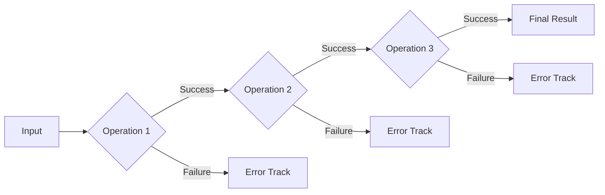

# Welcome to Metropy

A modern, type-safe Railway Oriented Programming (ROP) library for Python that provides a robust way to handle errors and compose operations.

## What is Railway Oriented Programming?

Railway Oriented Programming is a functional programming pattern that helps you handle errors and compose operations in a clean and maintainable way. Instead of using traditional try/except blocks, ROP treats success and failure cases as two parallel tracks that your data can follow.



## Why Metropy?

Metropy brings Railway Oriented Programming to Python in a way that feels natural and pythonic. Here's why you might want to use it:

- 🚂 **Railway Oriented Programming**: Handle errors elegantly with the `Result[T, E]` type
- 🔒 **Type Safety**: Full type hints support with generics and modern Python typing
- 🔗 **Functional Composition**: Chain operations with the `bind` and `map` operators
- 🎯 **Zero Dependencies**: Core functionality requires only Python 3.9+
- 🔄 **Async Support**: First-class support for async/await operations
- 🛡️ **Pydantic Integration**: Seamless integration with Pydantic for data validation
- 🎨 **Pythonic API**: Clean, intuitive interface following Python's best practices
- 🔍 **Comprehensive Error Handling**: Rich utilities for error transformation and recovery

## Quick Example

Here's a simple example of how Metropy makes error handling clean and composable:

```python
from metropy import Result, railway

@railway
def divide(a: float, b: float) -> Result[float, str]:
    if b == 0:
        return Result.failure("Division by zero")
    return Result.success(a / b)

@railway
def process_result(x: float) -> Result[str, str]:
    if x > 100:
        return Result.failure("Result too large")
    return Result.success(f"Final result: {x}")

# Chain operations using the | operator
result = (Result.success((100, 2))
         | divide
         | process_result)

print(result.unwrap())  # Output: "Final result: 50.0"
```

## Getting Started

- Check out the [Installation](getting-started/installation.md) guide to install Metropy
- Follow the [Quick Start](getting-started/quickstart.md) guide to learn the basics
- Read about [Basic Concepts](getting-started/concepts.md) to understand ROP
- Explore the [User Guide](user-guide/result.md) for detailed documentation

## Contributing

We welcome contributions! Please see our [Contributing Guide](contributing.md) for details on how to:

- Report bugs
- Suggest new features
- Submit pull requests
- Improve documentation

## License

This project is licensed under the MIT License - see the [LICENSE](https://github.com/francis/metropy-rop/blob/main/LICENSE) file for details. 